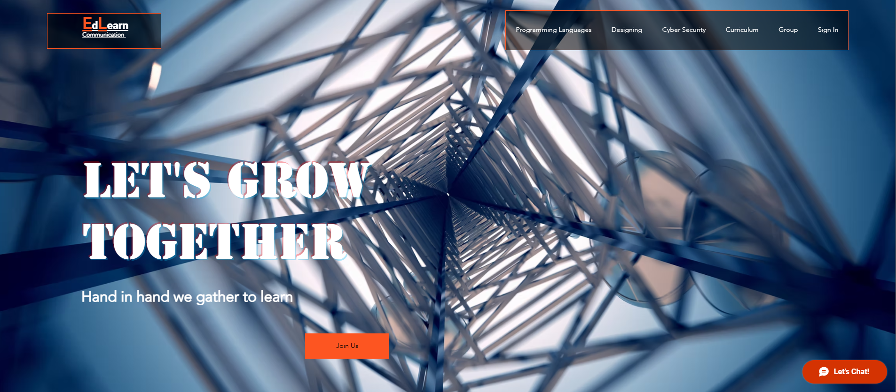
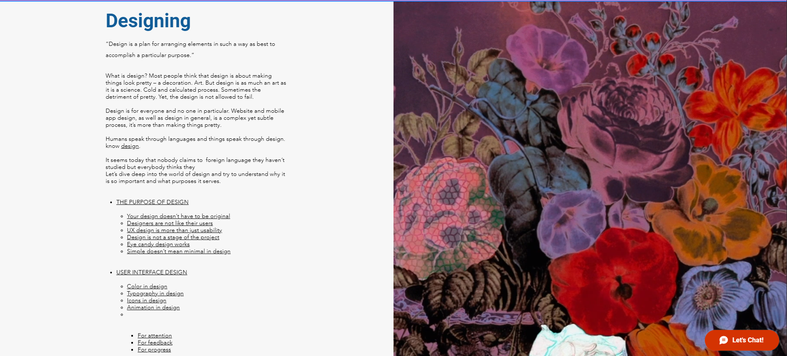
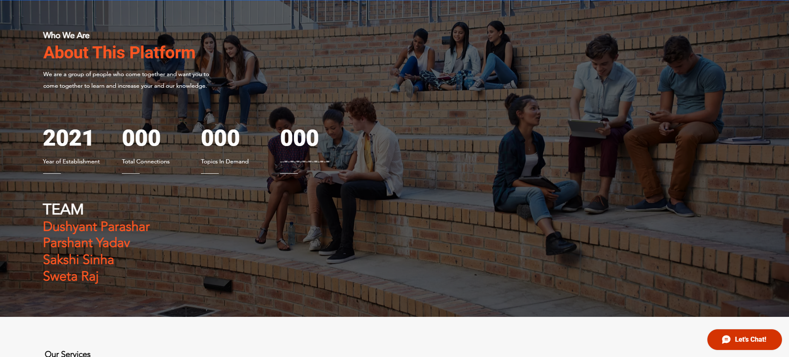
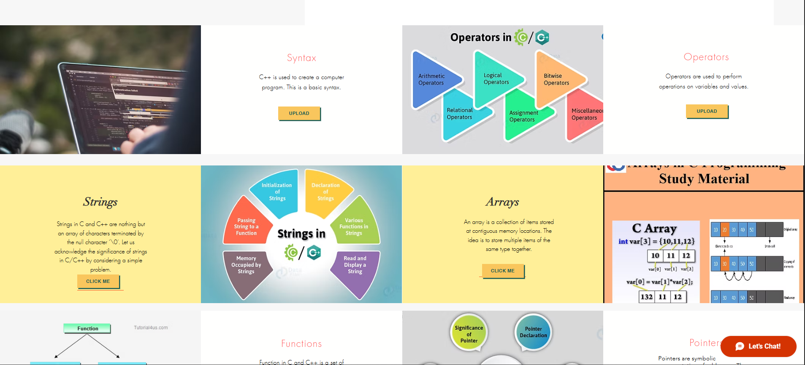
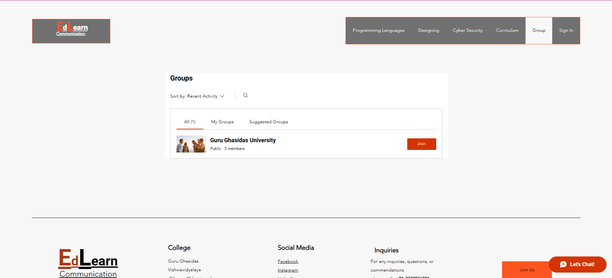
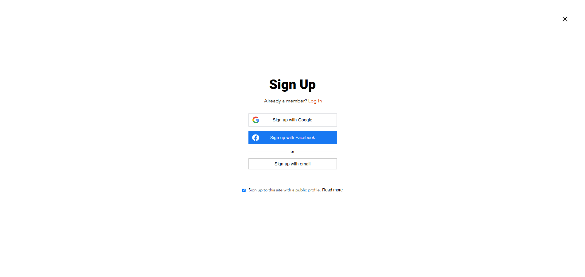

# EdLearn – A Pathway to Interact

**Live Website:** [https://yparshant610.wixsite.com/my-site-1](https://yparshant610.wixsite.com/my-site-1)

## 📌 Project Overview
EdLearn is a platform created using Wix for college students to connect, collaborate, and share knowledge.

## 🔧 Tools Used
- Wix Website Builder
- Custom Content Design
- SEO Optimization

## 🎯 Features
- Mobile-responsive layout
- Clean, student-focused interface
- Platform for peer-to-peer learning and networking

## 🙋‍♂️ My Role
- Conceptualization and design
- Content creation and SEO setup
- Web structure and deployment on Wix

## 📚 Learning Outcomes
- Improved skills in UI/UX using no-code tools
- Gained experience in designing and deploying user-friendly websites

## 📷 Project Screenshots

### 🏠 Homepage  

### 💻 Programming Languages  

### 🔐 Cyber Security  

### 🎨 Designing  

### 👥 About Us  

### 🚀 What We Provide  

### 📞 Contact Us  

### 📚 Books Section  

### 🧑‍🤝‍🧑 Groups  

### 🔍 Group Inside View  

### 📝 Sign Up Page  

